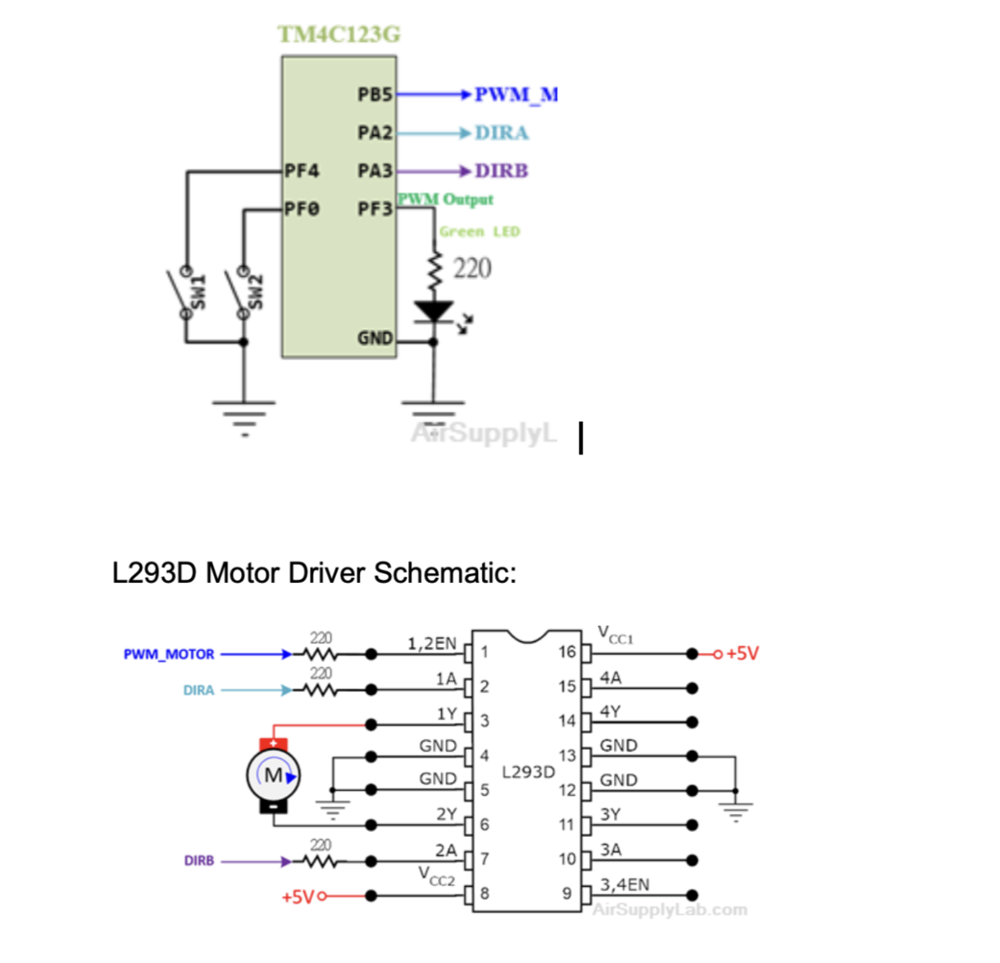

# Controlling a DC Motor and LED Using PWM
This project demonstrates how to control a DC motor and onboard LED using Pulse Width Modulation (PWM) signals generated by the TM4C123GXL microcontroller. Programmed in Embedded C using Keil µVision, the microcontroller generates two independent PWM signals. The DC motor speed is controlled across four discrete duty cycles (0%, 40%, 70%, and 100%), and the motor direction is toggled using GPIO bit manipulation in conjunction with an L293D motor driver. To achieve precise PWM signals at 400 Hz, the LOAD and CMP register values were carefully calculated and configured based on an 80 MHz system clock.

## 🔧 Features

- PWM control for both LED brightness and DC motor speed.
- Adjustable motor speed using onboard switch SW1.
- Change motor direction using onboard switch SW2.
  
## 🛠 Hardware Components

- **Tiva C Series LaunchPad** (TM4C123G microcontroller)
- **DC Motor**
- **L293D Motor Driver**
- **Resistors** 
- **Breadboard and Jumper Wires** 
- **Power Supply**

## Pin Configuration Table

| Device     | Port.Pin     | Signal Type | PCTL | Direction | Drive Mode |
|------------|--------------|--------------|------|-----------|-------------|
| PWM_MOTOR  | PORTB.PIN5   | Digital      | GPIO | OUT/POS   |             |
| LED        | PORTF.PIN3   | Digital      | GPIO | OUT/POS   |             |
| SW1        | PORTF.PIN4   | Digital      | GPIO | IN/NEG    | UP          |
| SW2        | PORTF.PIN0   | Digital      | GPIO | IN/NEG    | UP          |
| DIRA       | PORTA.PIN2   | Digital      | GPIO | OUT       |             |
| DIRB       | PORTA.PIN3   | Digital      | GPIO | OUT       |             |

##  Circuit Diagram

